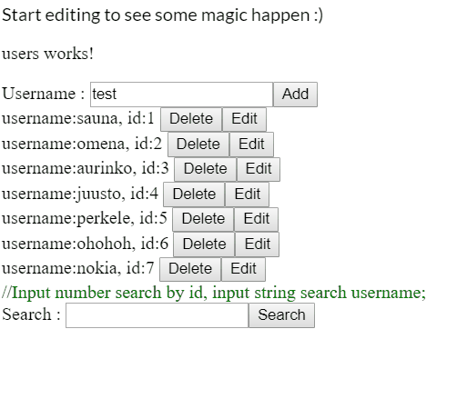

# angular-user-crud

A small project implemented by Angular 8 to achieve basic CRUD functions for a user Model. Add search functions for fun.
Use https://github.com/angular/in-memory-web-api.git as backend testing.

Function achieved:
  1. Add user;
  2. Delete user;
  3. Update username;
  4. Search user by username or id;

